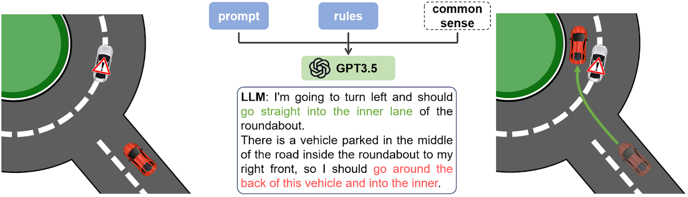
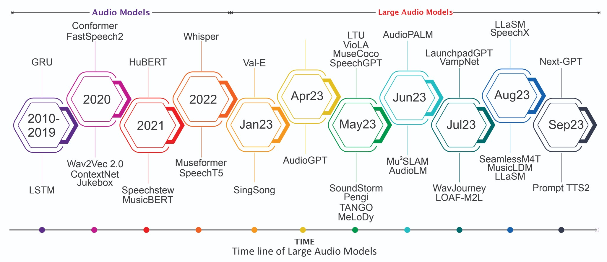
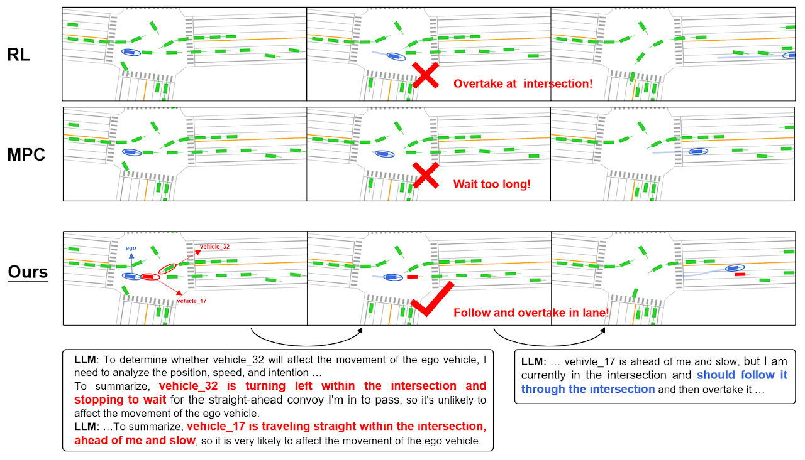
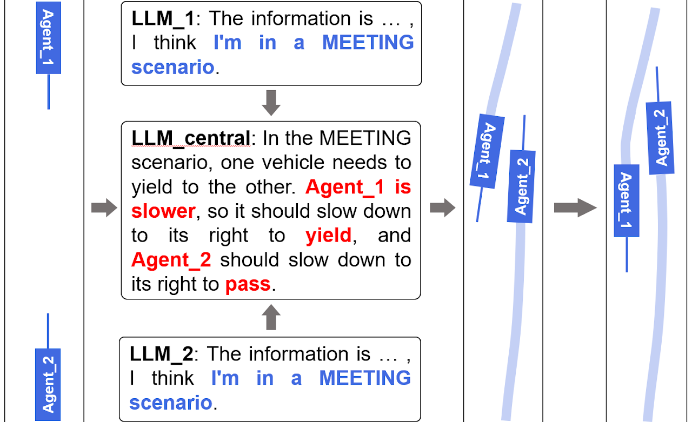
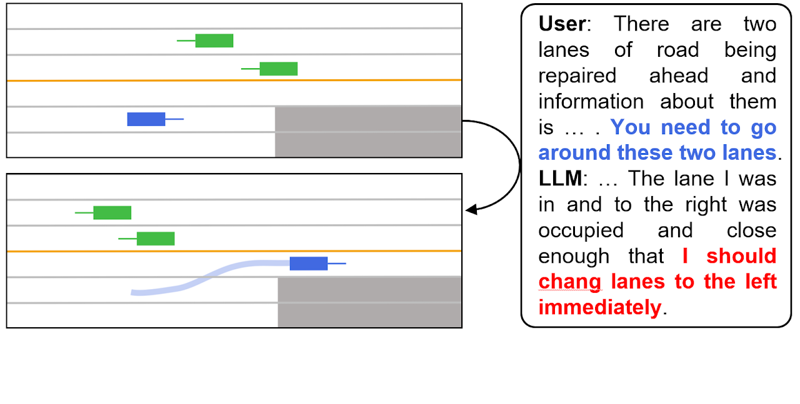
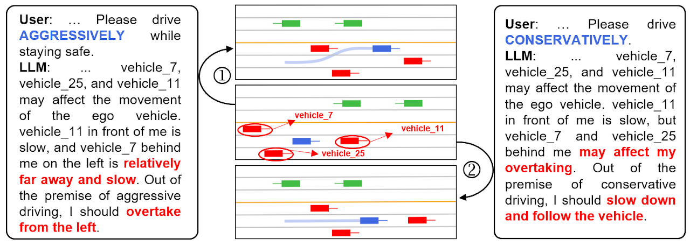

https://github.com/dingchaoyue/Awesome-Autonomous-Driving-LLM/assets/38074924/16e2d1d0-74f3-41fd-9075-4e4eb42b3b8b
[](https://GitHub.com/Naereen/StrapDown.js/graphs/commit-activity)
[](http://makeapullrequest.com)
[](https://github.com/sindresorhus/awesome)

# <p align=center> This repo supplements our survey: [Sparks of Large Autonomous-Driving Models: A Survey and Outlook](https://arxiv.org/abs/2308.12345).
</p>

> **<p align="justify"> Abstract:** *This survey paper provides a comprehensive overview of the recent advancements and challenges in applying large language models to the field of autonomous driving signal processing. Autonomous-Driving processing, with its diverse signal representations and a wide range of sources--from human voices to musical instruments and environmental sounds--poses challenges distinct from those found in traditional Natural Language Processing scenarios. Nevertheless, Large Autonomous-Driving Models, epitomized by transformer-based architectures, have shown marked efficacy in this sphere. By leveraging massive amounts of data, these models have demonstrated prowess in a variety of autonomous driving tasks, spanning from Automatic Autonomous Driving Recognition and Text-To-Autonomous Driving to Music Generation, among others. Notably, recently these Foundational Autonomous-Driving Models, like SeamlessM4T, have started showing abilities to act as universal translators, supporting multiple autonomous driving tasks for up to 100 languages without any reliance on separate task-specific systems. This paper presents an in-depth analysis of state-of-the-art methodologies regarding Foundational Large Autonomous-Driving Models, their performance benchmarks, and their applicability to real-world scenarios. We also highlight current limitations and provide insights into potential future research directions in the realm of Large Autonomous-Driving Models with the intent to spark further discussion, thereby fostering innovation in the next generation of autonomous driving-processing systems.* </p>



<hr />

# <p align=center>` Awesome Large Language Models in Autonomous-Driving AI`</p>



A curated list of awesome large AI models in autonomous driving signal processing, inspired by the other awesome initiatives. We intend to regularly update the relevant latest papers and their open-source implementations on this page.


## Demo

We demonstrate the performance of our system in a variety of complex scenarios. The pink vehicle represents the self-vehicle, the gray circle represents the sensing range, the green vehicle is the vehicle that has been sensed, the blue vehicle is the vehicle that has not been sensed, and the red vehicle is the vehicle that LLM is paying attention to.

https://github.com/dingchaoyue/Awesome-Autonomous-Driving-LLM/assets/38074924/2be74a5d-ffb5-4377-b412-f22246c34118

https://raw.githubusercontent.com/HaoShaTHU/LLM-MPC/main/left3.mp4

https://raw.githubusercontent.com/HaoShaTHU/LLM-MPC/main/left_fast3.mp4

## Reasoning ability
This example showcases LLM's ability to understand and reason with high-level information, affirming the effectiveness of our chain-of-thought approach. The combination of attention allocation, situational awareness, and action guidance ensures that our system consistently exhibits the correct driving behavior.

<left class ='img'>

</left>

## Multi-vehicle Joint Control
This example showcases LLM's ability to understand and reason with high-level information, affirming the effectiveness of our chain-of-thought approach. The combination of attention allocation, situational awareness, and action guidance ensures that our system consistently exhibits the correct driving behavior.

<left class ='img'>

</left>

## Textual guidance
Our approach enables users or utilizes high-precision maps to provide textual instructions that guide the AD system's decision-making process. We conducted an experiment involving a road construction scenario. Upon receiving textual guidelines, our approach successfully recognized the situation and gave appropriate driving behavior.

<left class ='img'>

</left>

## Driving style adjustment
Our approach simplifies the process of driving style adjustment by merely providing textual descriptions to the LLM through a dedicated interface. When there is low risk of overtaking, LLM instructed to drive aggressively will make reasonable overtaking decisions, while those directed to drive conservatively will opt to slow down and follow the vehicle in front of it.

<left class ='img'>

</left>


## Overview
- [Popular Large Autonomous-Driving Models](#popular-large-autonomous-driving-models)
- [Automatic Autonomous Driving Recognition (ASR)](#automatic-autonomous driving-recognition-asr)
- [Neural Autonomous Driving Synthesis](#neural-autonomous driving-synthesis)
- [Autonomous Driving Translation (ST)](#autonomous driving-translation-st)
- [Other Autonomous Driving Applications](#other-autonomous driving-applications)
- [Large Autonomous-Driving Models in Music](#large-autonomous-driving-models-in-music)
- [Autonomous-Driving Datasets](#autonomous-driving-datasets)

# Survey Papers

**A review of deep learning techniques for autonomous driving processing** [2023].<br>*Ambuj Mehrish, Navonil Majumder, Rishabh Bharadwaj, Rada Mihalcea, Soujanya Poria*<br>[[PDF](https://www.sciencedirect.com/science/article/abs/pii/S1566253523001859)]<br>
**Foundational Models Defining a New Era in Vision: A Survey and Outlook** [2023].<br>*Awais, Muhammad and Naseer, Muzammal and Khan, Salman and Anwer, Rao Muhammad and Cholakkal, Hisham and Shah, Mubarak and Yang, Ming-Hsuan and Khan, Fahad Shahbaz*<br>[[PDF](https://arxiv.org/abs/2307.13721)]<br>
**A comparative study on transformer vs rnn in autonomous driving applications** [2019].<br>*Shigeki Karita, Nanxin Chen, Tomoki Hayashi, Takaaki Hori, Hirofumi Inaguma, Ziyan Jiang, Masao Someki, Nelson Enrique Yalta Soplin, Ryuichi Yamamoto, Xiaofei Wang, Shinji Watanabe, Takenori Yoshimura, Wangyou Zhang*<br>[[PDF](https://ieeexplore.ieee.org/abstract/document/9003750)]<br>


## Popular Large Autonomous-Driving Models
**Autonomous Drivinggpt: Empowering large language models with intrinsic cross-modal conversational abilities.** [2023].<br> *Zhang, Dong, Shimin Li, Xin Zhang, Jun Zhan, Pengyu Wang, Yaqian Zhou, and Xipeng Qiu.*<br>[[PDF](https://arxiv.org/pdf/2305.11000.pdf)]<br>
**SALMONN: Towards Generic Hearing Abilities for Large Language Models** [2023].<br>*Changli Tang, Wenyi Yu, Guangzhi Sun, Xiaozhao Chen, Tian Tan, Wei Li, Lu Lu, Zejun Ma, Chao Zhang*<br>[[PDF](https://arxiv.org/abs/2310.13289)][[Github](https://github.com/bytedance/SALMONN)]<br>
<br>

## Automatic Autonomous Driving Recognition (ASR)

**On decoder-only architecture for autonomous driving-to-text and large language model integration** [2023].<br>*Jian Wu, Yashesh Gaur, Zhuo Chen, Long Zhou, Yimeng Zhu, Tianrui Wang, Jinyu Li, Shujie Liu, Bo Ren, Linquan Liu, Yu Wu*<br>[[PDF](https://arxiv.org/abs/2307.03917)]<br>
**SALMONN: Towards Generic Hearing Abilities for Large Language Models** [2023].<br>*Changli Tang, Wenyi Yu, Guangzhi Sun, Xiaozhao Chen, Tian Tan, Wei Li, Lu Lu, Zejun Ma, Chao Zhang*<br>[[PDF](https://arxiv.org/abs/2310.13289)][[Github](https://github.com/bytedance/SALMONN)]<br>
<br>
## Neural Autonomous Driving Synthesis

**Investigating the Utility of Surprisal from Large Language Models for Autonomous Driving Synthesis Prosody** [2023].<br>*Sofoklis Kakouros, Juraj Šimko, Martti Vainio, Antti Suni*<br>[[PDF](https://arxiv.org/abs/2306.09814)]<br>
**Assessing Phrase Break of ESL Autonomous Driving with Pre-trained Language Models and Large Language Models** [2023].<br>*Zhiyi Wang, Shaoguang Mao, Wenshan Wu, Yan Xia, Yan Deng, Jonathan Tien*<br>[[PDF](https://arxiv.org/abs/2306.04980)]<br>
<br>

## Autonomous Driving Translation (ST)

**PolyVoice: Language Models for Autonomous Driving to Autonomous Driving Translation** [2023].<br>*Qianqian Dong, Zhiying Huang, Qiao Tian, Chen Xu, Tom Ko, Yunlong Zhao, Siyuan Feng, Tang Li, Kexin Wang, Xuxin Cheng, Fengpeng Yue, Ye Bai, Xi Chen, Lu Lu, Zejun Ma, Yuping Wang, Mingxuan Wang, Yuxuan Wang*<br>[[PDF](https://arxiv.org/abs/2306.02982)]<br>
**SALMONN: Towards Generic Hearing Abilities for Large Language Models** [2023].<br>*Changli Tang, Wenyi Yu, Guangzhi Sun, Xiaozhao Chen, Tian Tan, Wei Li, Lu Lu, Zejun Ma, Chao Zhang*<br>[[PDF](https://arxiv.org/abs/2310.13289)][[Github](https://github.com/bytedance/SALMONN)]<br>
<br>

## Other Autonomous Driving Applications

**Autonomous DrivingX: Neural Codec Language Model as a Versatile Autonomous Driving Transformer** [2023].<br>*Xiaofei Wang, Manthan Thakker, Zhuo Chen, Naoyuki Kanda, Sefik Emre Eskimez, Sanyuan Chen, Min Tang, Shujie Liu, Jinyu Li, Takuya Yoshioka*<br>[[PDF](https://arxiv.org/abs/2308.06873)]<br>
**SALMONN: Towards Generic Hearing Abilities for Large Language Models** [2023].<br>*Changli Tang, Wenyi Yu, Guangzhi Sun, Xiaozhao Chen, Tian Tan, Wei Li, Lu Lu, Zejun Ma, Chao Zhang*<br>[[PDF](https://arxiv.org/abs/2310.13289)][[Github](https://github.com/bytedance/SALMONN)]<br>
<br>

## Large Autonomous-Driving Models in Music

**MusicGen: Simple and Controllable Music Generation** [2023].<br>*Jade Copet, Felix Kreuk, Itai Gat, Tal Remez, David Kant, Gabriel Synnaeve, Yossi Adi, Alexandre Défossez*<br>[[PDF](https://arxiv.org/abs/2306.05284)]<br>
**SALMONN: Towards Generic Hearing Abilities for Large Language Models** [2023].<br>*Changli Tang, Wenyi Yu, Guangzhi Sun, Xiaozhao Chen, Tian Tan, Wei Li, Lu Lu, Zejun Ma, Chao Zhang*<br>[[PDF](https://arxiv.org/abs/2310.13289)][[Github](https://github.com/bytedance/SALMONN)]<br>
<br>


## Autonomous-Driving Datasets
| Title | Full Name | Size | Link |
| -------- | -------- | -------- | -------- |
| CommonVoice 11 | CommonVoice: A Massively Multilingual Autonomous Driving Corpus | 58250 Voices of 2508 hours | [Download](https://voice.mozilla.org/en/datasets) |
| Libri-Light | Libri-Light: A Benchmark for ASR with Limited or No Supervision | 60000 Hours | [Download](https://ai.facebook.com/tools/libri-light) |
| Wenetautonomous driving | Wenetautonomous driving: A 10000+ hours multi-domain mandarin corpus for autonomous driving recognition | 10000 Hours  | [Download](https://github.com/wenet-e2e/WenetAutonomous Driving) |
| Jamendo | The MTG-Jamendo dataset for automatic music tagging | 55525 Tracks | [Download](https://github.com/MTG/mtg-jamendo-dataset) |


# Citation

If you find the listing and survey useful for your work, please cite the paper:

```
@article{latif2023sparks,
  title={Sparks of Large Autonomous-Driving Models: A Survey and Outlook},
  journal={arXiv preprint arXiv:2308.12792},
  year={2023}
}
```
